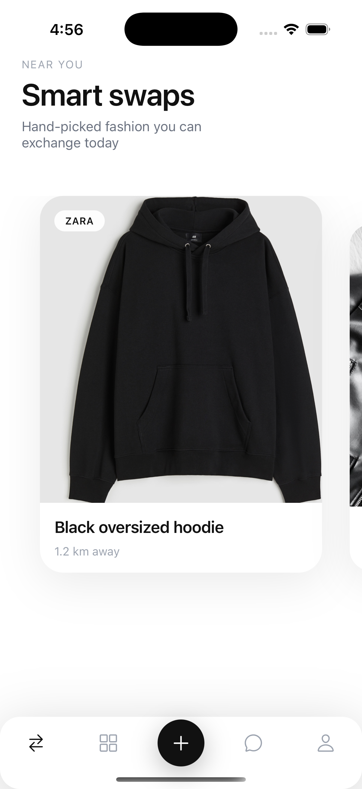
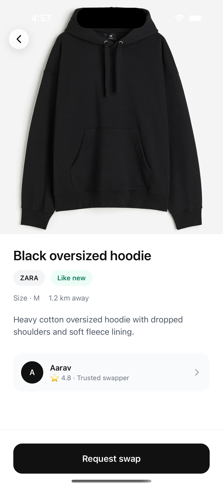
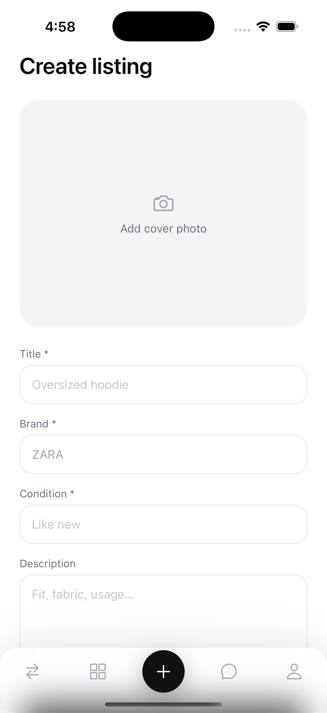

# 🖤 99dresses

**A premium, urban clothing-swap app — built with Expo & React Native.**

> Trade clothes, not money.  
> Smart matching. Transparent credits. Minimal design.

---

## ✨ Overview

**99dresses** is a mobile-first fashion exchange app where users discover intelligent clothing swaps near them.  
Instead of buying and selling, users directly exchange items and use platform credits only to balance value differences.

This project focuses on:

- High-quality mobile UI
- Smooth interactions
- Explainable matching & credit logic
- Scalable frontend architecture

---

## 🧠 Core Idea

Add item → discover smart swap → compare → send proposal  
→ accept → chat → meet → complete

No payments.  
No pricing.  
Only fair, transparent swaps.

---

## 🖼️ Key Screens

  
  
  

  <strong>Smart Swaps feed</strong> &nbsp;•&nbsp;
  <strong>Swap detail & request</strong> &nbsp;•&nbsp;
  <strong>Create listing</strong>

---

## 🔁 Swap Flow

1. User uploads clothing items  
2. App suggests nearby swap matches  
3. User compares both items  
4. Sends a swap proposal  
5. Other user accepts  
6. Credits are automatically adjusted  
7. Chat unlocks  
8. Both users confirm exchange  
9. Swap is completed  

---

## 💳 Credit System (Frontend Logic)

Each item receives an estimated credit value based on:

- Category
- Brand tier
- Condition
- Local demand bonus

Credits are only used to balance mismatched values.  
They cannot be withdrawn or converted to money.

---

## 🧱 Frontend Architecture

This project follows a feature-driven and domain-layered structure.

